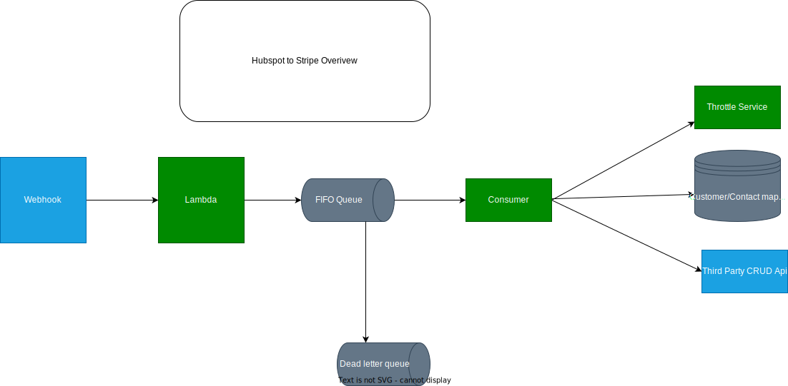
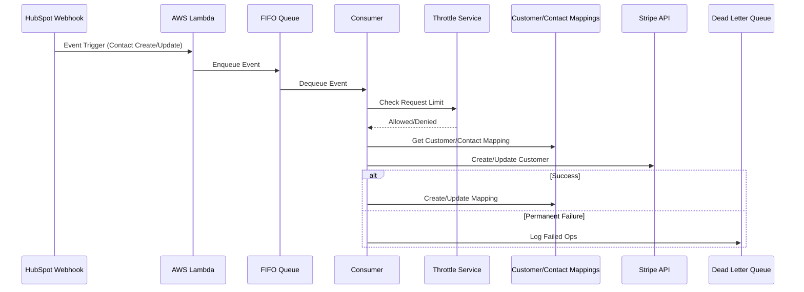
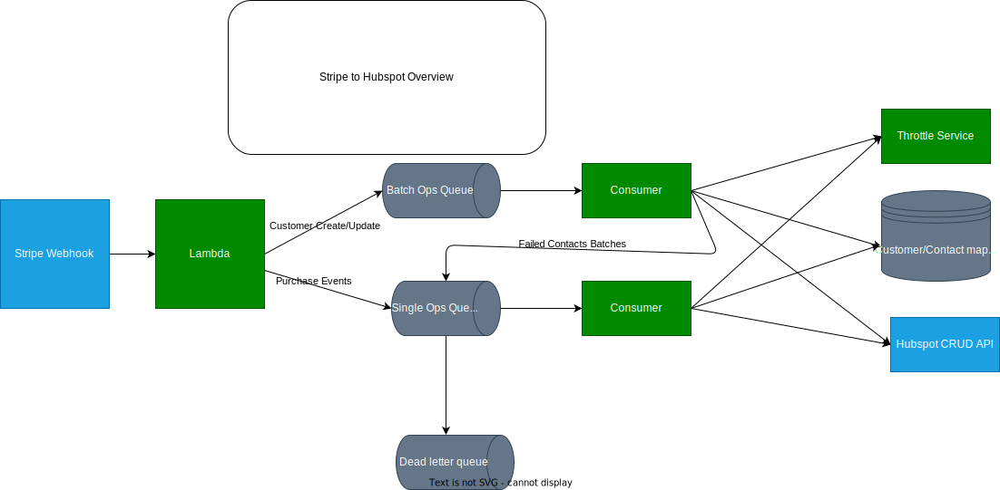
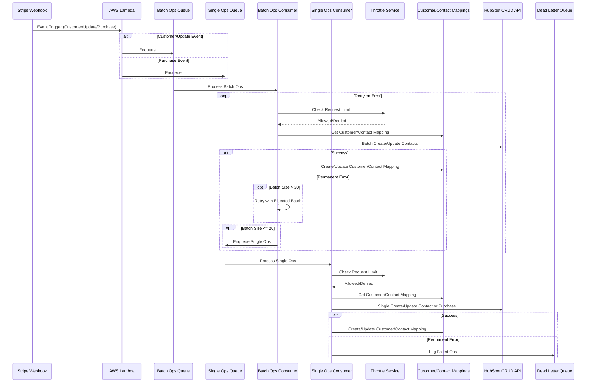

# System Design for Data Integration between Stripe and HubSpot

## Hubspot to Stripe

### Interaction Diagram
<!-- insert svg for hubspot to stripe -->

### Sequence Diagram

**Overview**:
The HubSpot to Stripe data flow ensures that changes in HubSpot contacts are reflected in the corresponding Stripe customers. This includes creating new customers in Stripe when new contacts are added in HubSpot and updating existing customers in Stripe when HubSpot contact details are modified.

**Data Flow Steps**:

1. **Event Trigger from HubSpot**:
   - HubSpot triggers a webhook event whenever a contact is created or updated. 
  
2. **AWS Lambda Processing**:
   - The event is received by an AWS Lambda function, which processes the incoming data and enqueues the event.

3. **Ops Queue**:
   - The Lambda function enqueues the event into a FIFO Queue. This queue serves as a buffer, allowing for asynchronous processing and ensuring that events are handled sequentially. Order is maintained by the queue, ensuring that events are processed in the correct order.

4. **Ops Consumer Processing**:
   - A Consumer dequeues the event from the Queue and begins processing. The consumer checks with the Throttle Service to manage the rate of outgoing API requests, ensuring compliance with API rate limits.

5. **Customer/Contact Mapping**:
   - The Consumer interacts with a Mappings service to retrieve or update the mapping between the HubSpot contact and the Stripe customer. This step is crucial for maintaining data consistency across both systems.

6. **Stripe API Interaction**:
   - The consumer makes an API call to Stripe to create or update the corresponding customer record.

7. **Error Handling**:
   - In the case of transient errors (e.g., network issues, rate limiting), the consumer retries the operation with a retry limit, exponential backoff, and jitter to avoid the thundering herd problem.
   - In case of permanent errors (e.g., invalid data), the failed event is logged into a Dead Letter Queue (DLQ). This DLQ allows for alerting, manual inspection, and intervention to resolve issues that cannot be automatically retried.

## Stripe to Hubspot
### Interaction Diagram
<!-- insert svg for stripe to hubspot -->

### Sequence Diagram

**Overview**:
The Stripe to HubSpot data flow handles for the fact that the Hubspot API accepts batched create/update operations for contacts, but only has a single create/update operation for custom logs. The Hubspot API also has a rate limit of 15 requests per second, which is significantly lower than Stripe's rate limit of 100 requests per second, so usage of batch operations is crucial to ensure that data is synced in a timely manner.

**Data Flow Steps**:

1. **Event Trigger from Stripe**:
   - Stripe triggers a webhook event whenever a customer is created, updated, or makes a purchase.

2. **AWS Lambda Processing**:
   - The event is received by an AWS Lambda function, which determines the type of event. The function decides whether the event should be routed for batch operations (e.g., customer create/update) or single operations (e.g., purchase events).

3. **Queueing**:
   - **Batch Ops Queue**: Customer create/update events are enqueued in the Batch Ops Queue for batch processing.
   - **Single Ops Queue**: Purchase events are enqueued in the Single Ops Queue for individual processing.

4. **Batch Ops Consumer**:
   - The Batch Ops Consumer processes events from the Batch Ops Queue, interacting with the Throttle Service to manage API rate limits. It then retrieves or updates the mapping between the Stripe customer and HubSpot contact and makes batch API calls to HubSpot to update or create contact records.

   - **Retry Logic**: If a batch operation encounters permanent errors, the batch is bisected, and the retry process continues until the batch size is below 20. If errors persist at this size, the batch is forwarded to the Single Ops Queue for individual processing.

5. **Single Ops Consumer**:
   - The Single Ops Consumer processes events from the Single Ops Queue. It also interacts with the Throttle Service and the Mappings service, ensuring that individual customer or purchase events are appropriately logged in HubSpot.

6. **Error Handling**:
   - In case of transient errors (e.g., network issues, rate limiting), the consumer retries the operation with a retry limit, exponential backoff, and jitter to avoid the thundering herd problem.
   - For any failed operations, particularly after retries, the event is logged into the Dead Letter Queue (DLQ) for further inspection, alerting, and potential manual resolution.
